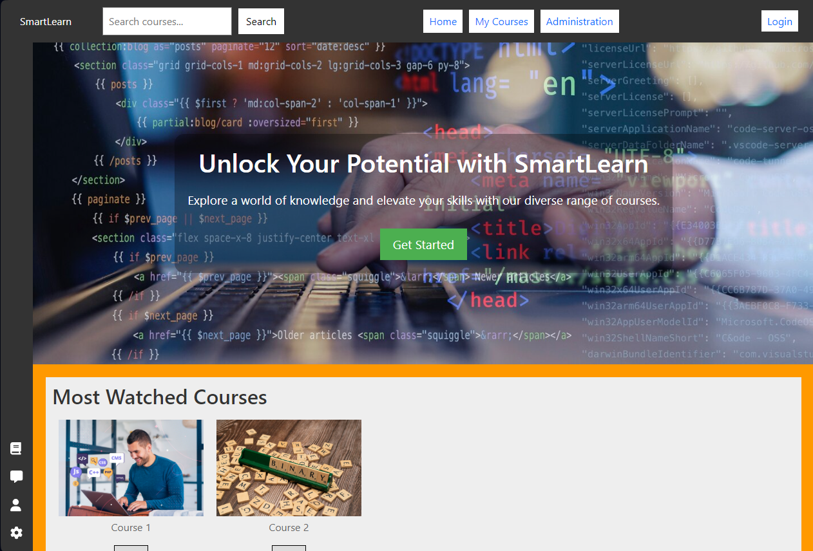

#  Smart_Learn

## About Our SmartLearn Platform

Welcome to our e-learning platform! We are dedicated to providing a comprehensive and accessible learning experience for individuals of all backgrounds. Whether you are a student, professional, or someone eager to acquire new skills, our platform is designed to cater to your educational needs.

### Key Features:

- Wide Range of Courses: Explore a diverse selection of courses across various subjects.

- Expert Instructors: Learn from industry experts and experienced educators.

- Interactive Learning: Engage in interactive and hands-on learning experiences.

- Flexible Schedule: Study at your own pace and schedule.

- Progress Tracking: Monitor your progress and achievements throughout the courses.

### Our Mission:

Our mission is to empower individuals through education. We believe that learning is a lifelong journey, and our platform aims to make quality education accessible to everyone.

Join us on this educational adventure and unlock your full potential!

### [SmartLearn](https://github.com/aymenidou/Smart_Learn)

